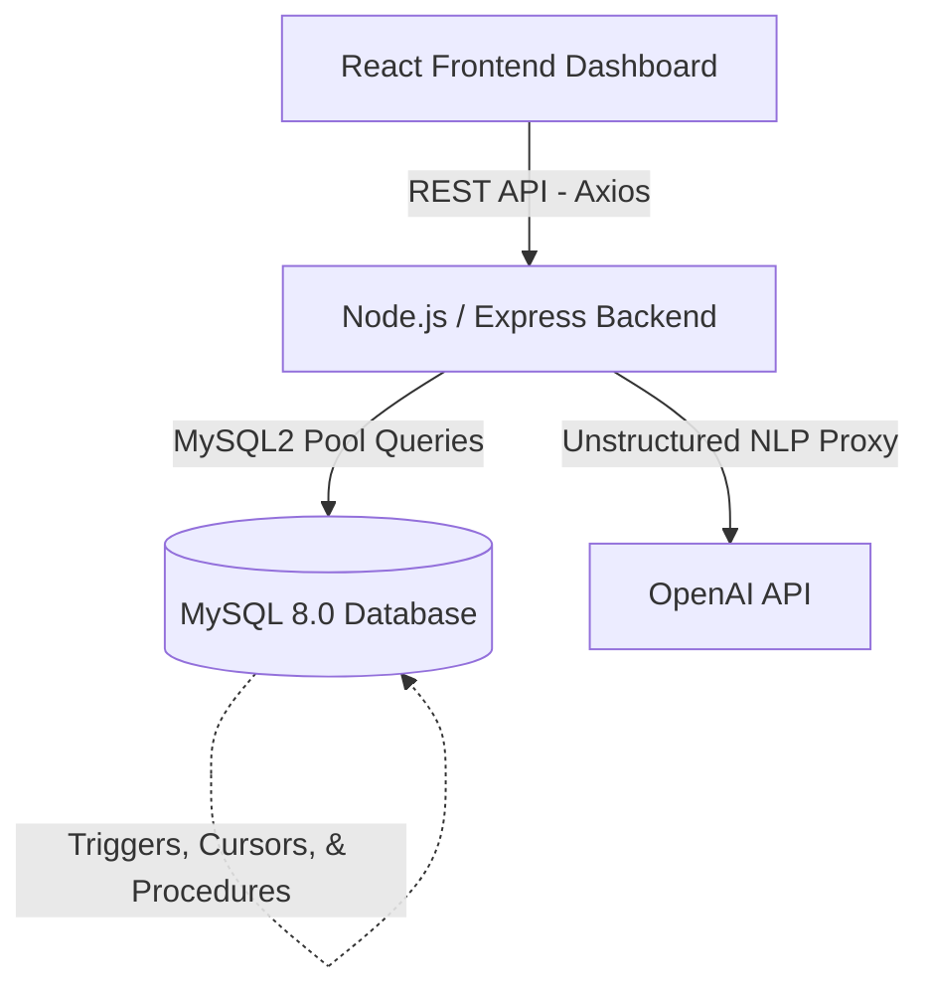
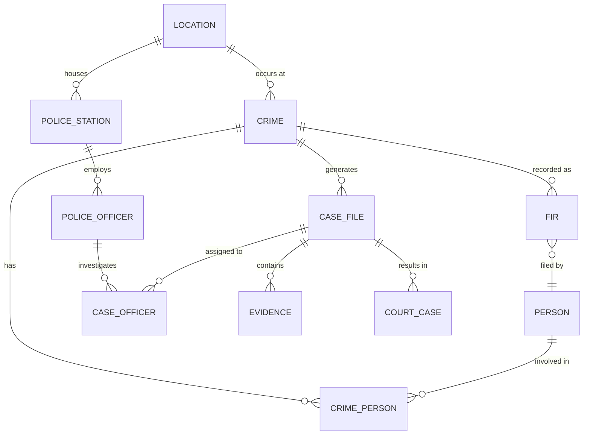

# Crime Management System

> A full-stack, enterprise-grade web application for managing criminal investigations, built as a comprehensive course project for **Introduction to Database Systems (CSD317)**.

---

## Table of Contents

- [Overview](#overview)
- [Team](#team)
- [System Architecture](#system-architecture)
- [Tech Stack](#tech-stack)
- [Database Design](#database-design)
  - [ER Diagram & Relationships](#er-diagram--relationships)
  - [Tables & Schema](#tables--schema)
  - [Normalization Matrix](#normalization-matrix)
  - [Integrity Constraints](#integrity-constraints)
  - [Stored Routines & DB Logic](#stored-routines--db-logic)
  - [Advanced SQL & ACID Transactions](#advanced-sql--acid-transactions)
- [Application Features](#application-features)
- [Project Structure](#project-structure)
- [Getting Started](#getting-started)
- [API Reference](#api-reference)
- [Screenshots](#screenshots)

---

## Overview

The **Crime Management System (CMS)** natively models the complete granular lifecycle of a criminal investigation.
It tracks the organic flow from the initial **FIR (First Information Report)** filing, through rigorous case investigation, evidence aggregation, and suspect bridging, all the way to finalized **Court Proceedings** and verdicts.

The system securely manages over 13 interrelated relational entities, all strictly normalized to **3NF or higher**, with full referential integrity enforced natively via MySQL constraints. It acts as a production-ready application featuring a React-based interactive geospatial frontend, an Express.js internal REST API, and native AI ingestion for unstructured crime data reporting.

---

## Team

| Name | Roll Number | Role |
|------|-------------|------|
| **Ishanvi Singh** | 2410110150 | Team Lead / Architecture |
| **Anant Joshi** | 2410110049 | Backend & DB Design |
| **Akshat Bansal** | 2410110039 | Frontend & Analytics |
| **Arpit Goel** | 2410110075 | UI/UX & Geospatial Mapping |
| **Manasvi Sharma** | 2410110195 | Security & NLP Integration |

**Submitted to:** Prof. Sonia Khetarpaul  
**Course:** Introduction to Database Systems  
**Institution:** Shiv Nadar Institution of Eminence

---

## System Architecture

The CMS is built using a modern 3-tier architecture that guarantees separation of concerns:



*   **Frontend (Presentation):** React renders interactive dynamic views (Leaflet Maps, Recharts) based on state data retrieved via REST.
*   **Backend (Application Logic):** Express.js routes act as the controller managing business logic, validating payloads, and orchestrating complex SQL queries.
*   **Database (Storage Engine):** MySQL 8.0 natively enforces ACID properties, relational junctions, and constraint-based integrity.

---

## Tech Stack

| Layer | Technology Implemented |
|-------|-----------|
| **Frontend Frame** | React 18, Vite |
| **Aesthetic Styling** | Tailwind CSS, Lucide React Icons |
| **Analytics Charting** | Recharts |
| **Geospatial Maps** | React-Leaflet + Leaflet |
| **PDF Generation** | jsPDF + jspdf-autotable |
| **Router Matrix** | React Router v6 |
| **HTTP Client** | Axios |
| **Backend Config** | Node.js, Express.js |
| **File I/O Uploads** | Multer |
| **AI Integration** | OpenAI Node.js SDK (gpt-4o-mini) |
| **Database Core** | MySQL 8.0 |
| **DB Link Driver** | `mysql2/promise` (for strictly-typed async operations) |

---

## Database Design

### ER Diagram & Relationships

The schema contains **13 Tables** deeply intertwined with strict referential hooks:



### Tables & Schema

#### 1. `Location`
Stores geographic location data. Extended to support floating-point GPS coordinates for advanced geospatial dashboard layers.

| Column | Type | Constraints |
|--------|------|-------------|
| `location_id` | INT | PK, AUTO_INCREMENT |
| `address` | VARCHAR(255) | NULL |
| `city` | VARCHAR(100) | NULL |
| `state` | VARCHAR(100) | NULL |
| `pincode` | VARCHAR(10) | NULL |
| `latitude` | DECIMAL(10,6) | NULL |
| `longitude` | DECIMAL(10,6) | NULL |

#### 2. `Person`
The core civic entity table tracking involved individuals (suspects, victims, witnesses).

| Column | Type | Constraints |
|--------|------|-------------|
| `person_id` | INT | PK, AUTO_INCREMENT |
| `name` | VARCHAR(100) | NOT NULL |
| `age` | INT | NULL |
| `gender` | VARCHAR(10) | NULL |
| `phone_number` | VARCHAR(15) | NULL |
| `address` | VARCHAR(255) | NULL |

#### 3. `Police_Station`
Represents the structural jurisdiction hubs allocating forces.

| Column | Type | Constraints |
|--------|------|-------------|
| `station_id` | INT | PK, AUTO_INCREMENT |
| `station_name` | VARCHAR(100) | NOT NULL |
| `location_id` | INT | FK → Location |
| `jurisdiction_area` | VARCHAR(255) | NULL |

#### 4. `Police_Officer`
Authoritative entities executing cases. Bound strictly to one native station.

| Column | Type | Constraints |
|--------|------|-------------|
| `officer_id` | INT | PK, AUTO_INCREMENT |
| `name` | VARCHAR(100) | NOT NULL |
| `designation` | VARCHAR(50) | NULL |
| `badge_number` | VARCHAR(50) | UNIQUE, NOT NULL |
| `phone_number` | VARCHAR(15) | NULL |
| `station_id` | INT | FK → Police_Station |

#### 5. `Crime`
The catalyst table. Every recorded criminal variance begins here.

| Column | Type | Constraints |
|--------|------|-------------|
| `crime_id` | INT | PK, AUTO_INCREMENT |
| `crime_type` | VARCHAR(50) | NOT NULL |
| `date` | DATE | NOT NULL |
| `time` | TIME | NULL |
| `location_id` | INT | FK → Location |
| `description` | TEXT | NULL |
| `status` | VARCHAR(50) | `Open` / `Closed` / `Investigating` |

#### 6. `Case_File`
Investigation node opened for each authenticated crime, housing evidence and officers.

| Column | Type | Constraints |
|--------|------|-------------|
| `case_id` | INT | PK, AUTO_INCREMENT |
| `crime_id` | INT | FK → Crime |
| `lead_officer_id` | INT | FK → Police_Officer |
| `case_status` | VARCHAR(50) | NULL |
| `start_date` | DATE | NULL |
| `end_date` | DATE | NULL |

#### 7. `Court_Case`
Logs procedural legal proceedings stemming exclusively from Case Files.

| Column | Type | Constraints |
|--------|------|-------------|
| `court_case_id` | INT | PK, AUTO_INCREMENT |
| `case_id` | INT | FK → Case_File |
| `court_name` | VARCHAR(100) | NULL |
| `verdict` | VARCHAR(50) | `Guilty` / `Acquitted` / `Pending` / `Dismissed` |
| `hearing_date` | DATE | NULL |

#### 8. `FIR` (First Information Report)
The initial verified complaint formalizing the crime reporting phase.

| Column | Type | Constraints |
|--------|------|-------------|
| `fir_id` | INT | PK, AUTO_INCREMENT |
| `crime_id` | INT | FK → Crime |
| `filed_by` | INT | FK → Person |
| `filing_date` | DATE | NOT NULL |
| `description` | TEXT | NULL |

#### 9. `Case_Officer` *(Junction Table | M:N)*
Associates multiple investigatory officers into task-forces for single intensive cases.

| Column | Type | Constraints |
|--------|------|-------------|
| `case_id` | INT | PK, FK → Case_File |
| `officer_id` | INT | PK, FK → Police_Officer |

#### 10. `Crime_Person` *(Junction Table | M:N)*
Associates Persons with Crimes allowing varied concurrent involvements.

| Column | Type | Constraints |
|--------|------|-------------|
| `crime_id` | INT | PK, FK → Crime |
| `person_id` | INT | PK, FK → Person |
| `role` | VARCHAR(20) | `Suspect` / `Victim` / `Witness` |

#### 11. `Evidence`
Physical/Digital item tracker linking items collected to cases.

| Column | Type | Constraints |
|--------|------|-------------|
| `evidence_id` | INT | PK, AUTO_INCREMENT |
| `case_id` | INT | FK → Case_File |
| `evidence_type` | VARCHAR(100) | NULL |
| `description` | TEXT | NULL |
| `collected_date` | DATE | NULL |
| `file_path` | VARCHAR(500) | NULL (Attachment Pointer) |

#### 12. `Audit_Log` *(Secure Ledger)*
Immutable immutable record tracking DML operations protecting internal system truth.

| Column | Type | Constraints |
|--------|------|-------------|
| `log_id` | INT | PK, AUTO_INCREMENT |
| `table_name` | VARCHAR(50) | NOT NULL |
| `operation` | VARCHAR(10) | `INSERT` / `UPDATE` / `DELETE` |
| `record_id` | INT | NULL |
| `changed_by` | VARCHAR(100) | DEFAULT `'system'` |
| `changed_at` | DATETIME | DEFAULT CURRENT_TIMESTAMP |
| `details` | TEXT | Descriptive footprint of values |

---

### Normalization Matrix

All schema tables satisfy stringent **3NF / BCNF** rules:

| Table Axis | Normal Form | Theoretical Justification |
|-------|-------------|---------------|
| `Location` | 3NF | All address and geospatial attributes directly describe the location identifier. |
| `Crime` | 3NF | All non-key attributes (description, date) depend solely on `crime_id`; Location transitive dependency is removed via FKs. |
| `Case_File` | 3NF | No partial or transitive functional dependencies exist beyond case limits. |
| `Case_Officer`| **BCNF** | Composite Primary Key contains no non-trivial functional dependencies. |
| `FIR` | 3NF | Eradicates transitive links; `filing_date` determined exclusively by `fir_id`. |
| `Evidence` | 3NF | Eliminates transitive hooks; description natively relies onto `evidence_id`. |
| `Police_Officer`| 3NF | Station identifier is extracted to avoid duplicating station structural details. |

---

### Integrity Constraints

The structural integrity relies heavily on explicitly declared native constraints:

*   **Entity Integrity:** Enforced by strict `AUTO_INCREMENT` Primary Keys across independent tables and `Composite Primary Keys` preventing duplicate loops on mapping tables (`Case_Officer`).
*   **Referential Integrity:** Enforced by mapped Foreign Keys chaining every table back to foundational elements (Location/Person).
*   **Domain Integrity:** Unique Constraints established on critical variables like `Police_Officer.badge_number` blocking administrative impersonation errors.
*   **Safety Hooks:** Utilizations of `ON DELETE CASCADE` mechanisms (such as Evidence File deletions) preventing orphaned pointers within the database pool.

---

### Stored Routines & DB Logic

*   **Stored Procedure: `GetCaseDetails(p_case_id)`**
    Compiles a massive multi-table inner join fetching `Case_File`, `Crime`, `Police_Officer`, and `Location` natively inside MySQL caching, bypassing repetitive API looping.
*   **Stored Function: `GetCrimeCount(p_city)`**
    Operates as an isolated deterministic SQL math function enabling rapid analytics pulls.
*   **Database Triggers (`after_crime_insert`)**
    Fires on backend schema insert events. Inserting a crime automates the creation of an attached investigatory `Case_File`. This guarantees structural cohesion.
*   **Audit Cursors & Triggers (`audit_crime_update`)**
    Traverses edits and systematically records footprint actions guaranteeing an immutable DML record history.

---

### Advanced SQL & ACID Transactions

#### 1. Common Table Expressions (CTEs) & Window Functions
We utilize highly advanced native SQL logic beyond standard CRUD. 
On the Dashboard `api/dashboard/advanced-stats`, a heavily customized query utilizes a `WITH RankedCrimes AS (...)` CTE to group overlapping crime variants. It then explicitly invokes an Analytical Window Function, `RANK() OVER (PARTITION BY city ORDER BY count DESC)`, filtering results natively to output solely the peak crime hotpot type per location array.

#### 2. Atomic AI Ingestion (`analyze.js`)
When an officer submits wild unstructured text to the Natural Language AI interface, the API returns complex nested JSON. Saving this involves creating `Locations`, `Crimes`, `Persons` and tying `Crime_Person` simultaneously. 
* To prevent partial logic failures, we explicitly wrap the block inside an organic `await connection.beginTransaction()`. 
* If ANY query sequence fails due to invalid parameters, `await connection.rollback()` triggers—securing the environment via classical **Atomicity (ACID)** rules.

---

## Application Features

### 1. Dashboard & Geospatial Overview
The centralized command station of the application.
- **Geospatial Hotspot Map:** Plots `Latitude/Longitude` database inputs directly into a React-Leaflet interactive cartography hub representing real-time criminal density.
- **Advanced City Hotspots:** Utilizes the aforementioned Window Functions to evaluate worst-case scenario metric types dynamically without manual intervention.
- **Aggregate Analytics:** Statistical stat cards, pie distributions, area timelines, and bar layouts parsed seamlessly via Recharts.

### 2. Crime Records Core
- Provides exhaustive paginated `CRUD` capabilities securely interfacing with `crimes.js`.
- Capable of deeply nested filtration using dynamic `WHERE / LIKE` SQL queries depending on user payload parameters.
- Linking functionality directly routes to suspects/victims matrices.

### 3. Investigation Hub (Case Files)
- Generates directly from the original Crime catalyst. Highly secure structural `CRUD` limits.
- Supports PDF download structures aggregating multi-table case elements into cleanly formatted incident dossiers.
- Contains specific integrations utilizing the GPT-4o-mini interface to autogenerate abstract forensic summaries reading Case properties dynamically.

### 4. Forensic Evidence Locker
- Advanced card-based viewing arrays natively segregating inputs (`CCTV`, `Weapon`, `DNA Data`, `Digital Records`).
- Natively bound to `Case IDs` supporting direct Multi-part `Multer` file routing for localized data retention uploads attached directly to DB Pointers.

### 5. FIR Generation & Court Tracking
- **FIR Logic:** Formalizes relationships between `Person` filing entities and `Crime` events structurally via timestamp enforcement.
- **Court Cases:** Maps judicial trajectories. Shifting a case from `Pending` to `Acquitted`/`Guilty` implicitly finalizes associated open Case Files.

### 6. Persons, Officers, and Location Registry
- Renders interconnected localized relational tables allowing administrative overview over distinct `Officer Badge IDs`, `Person Roles`, and strictly identified structural `Location Pins`.

---

## Project Structure

```text
crime-mgmt/
├── schema.sql                  # Massive DB Blueprint (DDL, Roles, Views)
├── novelty_patch.sql           # Audit Log Appendices & Triggers
├── README.md
├── backend/
│   ├── server.js               # Primary Express App Logic Hook
│   ├── db.js                   # MySQL connection pooling wrapper
│   ├── patch_locations.js      # Map Coordinates seeding runtime
│   ├── .env                    # Internal SECRETS (OpenAI, User/Pass)
│   ├── uploads/                # Dynamic Storage Pathing
│   └── routes/
│       ├── analyze.js          # OpenAI Transactional Ingestion
│       ├── dashboard.js        # Window Function & Geospatial Query Maps
│       ├── cases.js            # Node Routing (Cases/FIR mapping)
│       └── ...
└── frontend/
    ├── vite.config.js          # Compiling & Port Proxy routing
    ├── tailwind.config.js
    ├── package.json
    └── src/
        ├── App.jsx             # React Sub-Navigation Router Link
        ├── index.css
        ├── components/
        │   ├── CrimeMap.jsx    # The core Leaflet Mapping Matrix
        │   ├── Sidebar.jsx
        │   └── Modal.jsx
        └── pages/
            ├── Dashboard.jsx   # Live Analytical Display
            ├── Crimes.jsx
            ├── Cases.jsx
            └── Evidence.jsx
```

---

## Getting Started

### Prerequisites

| Engine Required | Compatibility Version |
|-------------|---------|
| **Node.js** | v18+ |
| **npm** | Package Manager Configured |
| **MySQL** | v8.0 (Crucial requirement for native Window Functions/CTEs compatibility) |

### 1. Database Initialization
Boot your local MySQL client or terminal interface and deploy the comprehensive blueprint schema and logs architecture.

```bash
mysql -u root -p < schema.sql
mysql -u root -p < novelty_patch.sql
```
*(This organically bootstraps the relational DB Schema Tables, Custom Constraints, Data Views, Event Triggers, Procedural Limits, The Forensic Audit tables, and thousands of seeded tracking arrays.)*

### 2. Backend Orchestration Configuration
Configure the MySQL integration and fetch NPM dependencies:

```bash
cd backend
cp .env.example .env
```
Open the generated `.env` and assign your secrets:
```env
DB_HOST=localhost
DB_USER=root
DB_PASSWORD=your_local_sql_runtime_password
DB_NAME=crime_db
PORT=5000
OPENAI_API_KEY=sk-your-openai-token-here  # Required for Case Summary AI parsing
```
Compile dependencies and seed coordinates:
```bash
npm install
node patch_locations.js   # Synchronizes GPS variables over Location strings
npm start
```
*(The REST API interface securely operates at HTTP `localhost:5000`)*

### 3. Frontend App Build
Launch the presentation interface:

```bash
cd frontend
npm install
npm run dev
```
*(React operates natively at `http://localhost:3000`. Vite automatically acts as a cross-origin reverse proxy channeling `/api` paths reliably and mitigating CORS conflicts).*

---

## API Reference

All application endpoints resolve securely utilizing pure JSON REST responses routing off base `http://localhost:5000`.

### Data Intelligence
| Protocol | Route Pathing | Native Description |
|--------|----------|-------------|
| `GET` | `/api/dashboard/stats` | Aggregated array sums for system nodes |
| `GET` | `/api/dashboard/advanced-stats` | Generates Window Function (`RANK()`) city analytics |
| `GET` | `/api/dashboard/locations-geospatial` | Outputs `LAT/LNG` objects paired with crime rates |
| `GET` | `/api/dashboard/monthly-trends` | Temporal timeline data arrays |

### Operations & Case Flow
| Protocol | Route Pathing | Native Description |
|--------|----------|-------------|
| `GET, POST, PUT, DELETE`| `/api/crimes` | `CRUD` operations mutating Crime Table logic |
| `GET, POST, PUT, DELETE`| `/api/cases` | Integrates deeply with linked Officer junction constraints |
| `GET, POST, PUT, DELETE`| `/api/evidence`| Handles internal text + physical Multer uploaded references |
| `GET, POST, PUT, DELETE`| `/api/court-cases`| Resolves trajectories influencing Case limits |

### Relational Bridges (Junction Endpoints)
| Protocol | Route Pathing | Native Description |
|--------|----------|-------------|
| `POST, DELETE`| `/api/crime-persons` | Manages M:N insertion linking Person arrays |
| `POST, DELETE`| `/api/case-officers` | Generates investigation team hooks |

### External AI (OpenAI Integration)
| Protocol | Route Pathing | Native Description |
|--------|----------|-------------|
| `POST` | `/api/analyze` | Generates intelligent entity extraction via unstructured parsing |

---

## Screenshots

> *The holistic application relies on a dark-themed, militaristic navy aesthetic interspersed with electric blue actions, dynamic modal overlays, and cleanly delineated relational data blocks.*

- **Dashboard:** Unparalleled geospatial charting combining statistical components and map integrations.
- **Audit Logging:** Clean analytical grid tracking comprehensive Before/After snapshots mitigating internal data sabotage.
- **Evidence Interface:** Card-centric design explicitly binding attached data files, timelines, and DNA mappings to secure locked cases.
- **AI Case Digest:** Auto-generated natural language incident overviews dynamically rendered instantly onto standard Case Files.

---
*Powered heavily by MySQL 8.0 Constraints · Engineered globally on React 18 / Tailwind CSS / Node.js Express*
