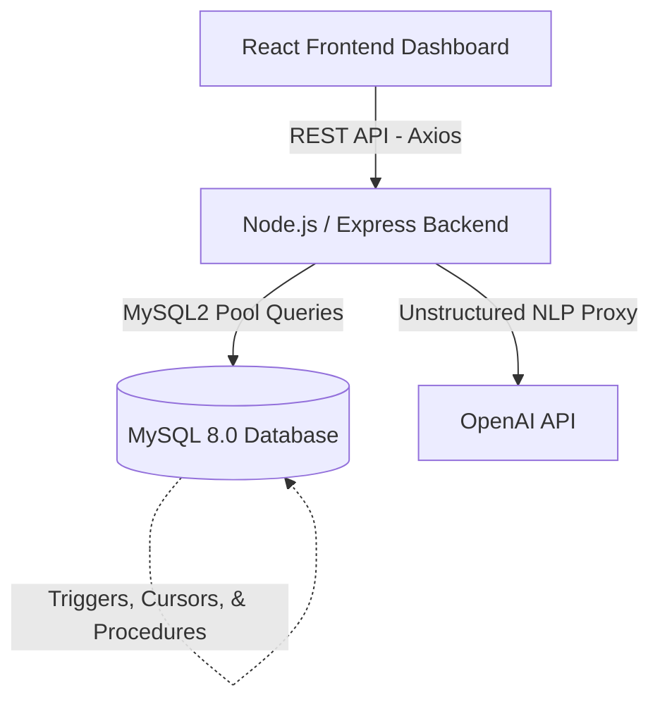
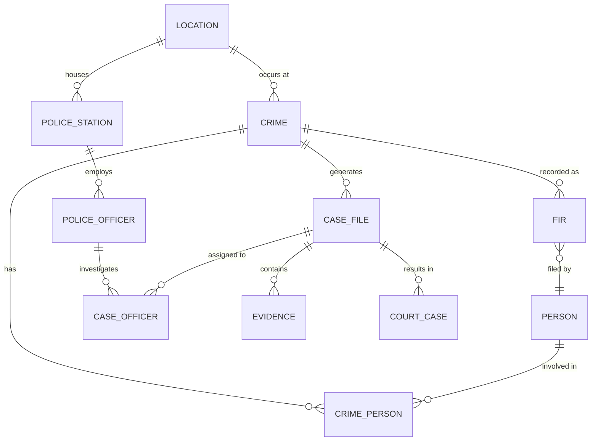

# Crime Management System

> A full-stack, enterprise-grade web application for managing criminal investigations, built as a comprehensive course project for **Introduction to Database Systems (CSD317)**.

---

## Table of Contents

- [Overview](#overview)
- [Team](#team)
- [System Architecture](#system-architecture)
- [Tech Stack](#tech-stack)
- [Database Design](#database-design)
  - [ER Diagram & Relationships](#er-diagram--relationships)
  - [Tables & Schema](#tables--schema)
  - [Normalization Matrix](#normalization-matrix)
  - [Integrity Constraints](#integrity-constraints)
  - [Stored Routines & DB Logic](#stored-routines--db-logic)
  - [Advanced SQL & ACID Transactions](#advanced-sql--acid-transactions)
- [Application Features](#application-features)
- [Project Structure](#project-structure)
- [Getting Started](#getting-started)
- [API Reference](#api-reference)

---

## Overview

The **Crime Management System (CMS)** natively models the complete granular lifecycle of a criminal investigation.
It tracks the organic flow from the initial **FIR (First Information Report)** filing, through rigorous case investigation, evidence aggregation, and suspect bridging, all the way to finalized **Court Proceedings** and verdicts.

The system securely manages over 13 interrelated relational entities, all strictly normalized to **3NF or higher**, with full referential integrity enforced natively via MySQL constraints. It acts as a production-ready application featuring a React-based interactive geospatial frontend, an Express.js internal REST API, and native AI ingestion for unstructured crime data reporting.

---

## Team

| Name | Roll Number | Contributions |
|------|-------------|------|
| **Akshat Bansal** | 2410110039 | **Project Lead & Full Stack:** Architecture, MERN setup, Dashboard analytics, API coordination. |
| **Ishanvi Singh** | 2410110150 | **DB Design & SQL:** ER Diagram, DDL Schema (3NF/BCNF), constraints, and documentation. |
| **Anant Joshi** | 2410110049 | **Advanced DB & Routes:** SQL routines (Procedures, Triggers, Views) and backend CRUD APIs. |
| **Arpit Goel** | 2410110075 | **Frontend UI & Novelties:** CRUD Pages, PDF Reports, Evidence Uploads, and Audit Logging. |
| **Manasvi Sharma** | 2410110195 | **Data & QA:** DML statements, sample seed generation, transaction testing, and Report Author. |

**Submitted to:** Prof. Sonia Khetarpaul  
**Course:** Introduction to Database Systems  
**Institution:** Shiv Nadar Institution of Eminence

---

## System Architecture

The CMS is built using a modern 3-tier architecture that guarantees separation of concerns:



*   **Frontend (Presentation):** React renders interactive dynamic views (Leaflet Maps, Recharts) based on state data retrieved via REST.
*   **Backend (Application Logic):** Express.js routes act as the controller managing business logic, validating payloads, and orchestrating complex SQL queries.
*   **Database (Storage Engine):** MySQL 8.0 natively enforces ACID properties, relational junctions, and constraint-based integrity.

---

## Tech Stack

| Layer | Technology Implemented |
|-------|-----------|
| **Frontend Frame** | React 18, Vite |
| **Aesthetic Styling** | Tailwind CSS, Lucide React Icons |
| **Analytics Charting** | Recharts |
| **Geospatial Maps** | React-Leaflet + Leaflet |
| **PDF Generation** | jsPDF + jspdf-autotable |
| **Router Matrix** | React Router v6 |
| **HTTP Client** | Axios |
| **Backend Config** | Node.js, Express.js |
| **File I/O Uploads** | Multer |
| **AI Integration** | OpenAI Node.js SDK (gpt-4o-mini) |
| **Database Core** | MySQL 8.0 |
| **DB Link Driver** | `mysql2/promise` (for strictly-typed async operations) |

---

## Database Design

### ER Diagram & Relationships

The schema contains **13 Tables** deeply intertwined with strict referential hooks:



### Tables & Schema

#### 1. `Location`
Stores geographic location data. Extended to support floating-point GPS coordinates for advanced geospatial dashboard layers.

| Column | Type | Constraints |
|--------|------|-------------|
| `location_id` | INT | PK, AUTO_INCREMENT |
| `address` | VARCHAR(255) | NULL |
| `city` | VARCHAR(100) | NULL |
| `state` | VARCHAR(100) | NULL |
| `pincode` | VARCHAR(10) | NULL |
| `latitude` | DECIMAL(10,7) | NULL |
| `longitude` | DECIMAL(10,7) | NULL |

#### 2. `Person`
The core civic entity table tracking involved individuals (suspects, victims, witnesses).

| Column | Type | Constraints |
|--------|------|-------------|
| `person_id` | INT | PK, AUTO_INCREMENT |
| `name` | VARCHAR(100) | NOT NULL |
| `age` | INT | NULL |
| `gender` | VARCHAR(10) | NULL |
| `phone_number` | VARCHAR(15) | NULL |
| `address` | VARCHAR(255) | NULL |

#### 3. `Police_Station`
Represents the structural jurisdiction hubs allocating forces.

| Column | Type | Constraints |
|--------|------|-------------|
| `station_id` | INT | PK, AUTO_INCREMENT |
| `station_name` | VARCHAR(100) | NOT NULL |
| `location_id` | INT | FK → Location |
| `jurisdiction_area` | VARCHAR(255) | NULL |

#### 4. `Police_Officer`
Authoritative entities executing cases. Bound strictly to one native station.

| Column | Type | Constraints |
|--------|------|-------------|
| `officer_id` | INT | PK, AUTO_INCREMENT |
| `name` | VARCHAR(100) | NOT NULL |
| `designation` | VARCHAR(50) | NULL |
| `badge_number` | VARCHAR(50) | UNIQUE, NOT NULL |
| `phone_number` | VARCHAR(15) | NULL |
| `station_id` | INT | FK → Police_Station |

#### 5. `Crime`
The catalyst table. Every recorded criminal variance begins here.

| Column | Type | Constraints |
|--------|------|-------------|
| `crime_id` | INT | PK, AUTO_INCREMENT |
| `crime_type` | VARCHAR(50) | NOT NULL |
| `date` | DATE | NOT NULL |
| `time` | TIME | NULL |
| `location_id` | INT | FK → Location |
| `description` | TEXT | NULL |
| `status` | VARCHAR(50) | `Open` / `Closed` / `Under Investigation` |

#### 6. `Case_File`
Investigation node opened for each authenticated crime, housing evidence and officers.

| Column | Type | Constraints |
|--------|------|-------------|
| `case_id` | INT | PK, AUTO_INCREMENT |
| `crime_id` | INT | FK → Crime |
| `lead_officer_id` | INT | FK → Police_Officer |
| `case_status` | VARCHAR(50) | NULL |
| `start_date` | DATE | NULL |
| `end_date` | DATE | NULL |

#### 7. `Court_Case`
Logs procedural legal proceedings stemming exclusively from Case Files.

| Column | Type | Constraints |
|--------|------|-------------|
| `court_case_id` | INT | PK, AUTO_INCREMENT |
| `case_id` | INT | FK → Case_File |
| `court_name` | VARCHAR(100) | NULL |
| `verdict` | VARCHAR(50) | `Guilty` / `Acquitted` / `Pending` / `Dismissed` |
| `hearing_date` | DATE | NULL |

#### 8. `FIR` (First Information Report)
The initial verified complaint formalizing the crime reporting phase.

| Column | Type | Constraints |
|--------|------|-------------|
| `fir_id` | INT | PK, AUTO_INCREMENT |
| `crime_id` | INT | FK → Crime |
| `filed_by` | INT | FK → Person |
| `filing_date` | DATE | NOT NULL |
| `description` | TEXT | NULL |

#### 9. `Case_Officer` *(Junction Table | M:N)*
Associates multiple investigatory officers into task-forces for single intensive cases.

| Column | Type | Constraints |
|--------|------|-------------|
| `case_id` | INT | PK, FK → Case_File |
| `officer_id` | INT | PK, FK → Police_Officer |

#### 10. `Crime_Person` *(Junction Table | M:N)*
Associates Persons with Crimes allowing varied concurrent involvements.

| Column | Type | Constraints |
|--------|------|-------------|
| `crime_id` | INT | PK, FK → Crime |
| `person_id` | INT | PK, FK → Person |
| `role` | VARCHAR(20) | `Suspect` / `Victim` / `Witness` |

#### 11. `Evidence`
Physical/Digital item tracker linking items collected to cases.

| Column | Type | Constraints |
|--------|------|-------------|
| `evidence_id` | INT | PK, AUTO_INCREMENT |
| `case_id` | INT | FK → Case_File |
| `evidence_type` | VARCHAR(100) | NULL |
| `description` | TEXT | NULL |
| `collected_date` | DATE | NULL |
| `file_path` | VARCHAR(500) | NULL (Attachment Pointer) |
| `file_name` | VARCHAR(255) | NULL |
| `file_type` | VARCHAR(100) | NULL |

#### 12. `Audit_Log` *(Secure Ledger)*
Immutable record tracking all DML operations, protecting internal system truth.

| Column | Type | Constraints |
|--------|------|-------------|
| `log_id` | INT | PK, AUTO_INCREMENT |
| `table_name` | VARCHAR(50) | NOT NULL |
| `operation` | VARCHAR(10) | `INSERT` / `UPDATE` / `DELETE` |
| `record_id` | INT | NULL |
| `changed_by` | VARCHAR(100) | DEFAULT `'system'` |
| `changed_at` | DATETIME | DEFAULT CURRENT_TIMESTAMP |
| `details` | TEXT | Descriptive footprint of values |

---

### Normalization Matrix

All schema tables satisfy stringent **3NF / BCNF** rules:

| Table Axis | Normal Form | Theoretical Justification |
|-------|-------------|---------------|
| `Location` | 3NF | All address and geospatial attributes directly describe the location identifier. |
| `Crime` | 3NF | All non-key attributes (description, date) depend solely on `crime_id`; Location transitive dependency is removed via FKs. |
| `Case_File` | 3NF | No partial or transitive functional dependencies exist beyond case limits. |
| `Case_Officer`| **BCNF** | Composite Primary Key contains no non-trivial functional dependencies. |
| `FIR` | 3NF | Eradicates transitive links; `filing_date` determined exclusively by `fir_id`. |
| `Evidence` | 3NF | Eliminates transitive hooks; description natively relies onto `evidence_id`. |
| `Police_Officer`| 3NF | Station identifier is extracted to avoid duplicating station structural details. |

---

### Integrity Constraints

The structural integrity relies heavily on explicitly declared native constraints:

*   **Entity Integrity:** Enforced by strict `AUTO_INCREMENT` Primary Keys across independent tables and `Composite Primary Keys` preventing duplicate loops on mapping tables (`Case_Officer`).
*   **Referential Integrity:** Enforced by mapped Foreign Keys chaining every table back to foundational elements (Location/Person).
*   **Domain Integrity:** Unique Constraints established on critical variables like `Police_Officer.badge_number` blocking administrative impersonation errors.
*   **Safety Hooks:** Utilizations of `ON DELETE CASCADE` mechanisms (such as Evidence File deletions) preventing orphaned pointers within the database pool.

---

### Stored Routines & DB Logic

*   **Stored Procedure: `GetCaseDetails(p_case_id)`**
    Compiles a massive multi-table inner join fetching `Case_File`, `Crime`, `Police_Officer`, and `Location` natively inside MySQL caching, bypassing repetitive API looping.
*   **Stored Procedure: `ListOpenCases()`**
    Uses a **cursor** to iterate over all open Case Files and return each case with its crime type and lead officer — demonstrating cursor-based row-level processing inside MySQL.
*   **Stored Function: `GetCrimeCount(p_city)`**
    Operates as an isolated deterministic SQL math function enabling rapid analytics pulls per city.
*   **18 Database Triggers**
    Covering all DML operations (INSERT / UPDATE / DELETE) on `Crime`, `Case_File`, `FIR`, `Evidence`, `Court_Case`, and `Crime_Person`. Two special triggers (`after_court_verdict_insert`, `after_court_verdict_update`) automatically close the linked Case File when a final verdict (Guilty/Acquitted/Dismissed) is recorded.
*   **4 Views**
    `vw_crime_summary`, `vw_case_details`, `vw_fir_details`, `vw_suspect_list` — pre-joined snapshots used by API queries to reduce round-trips.

---

### Advanced SQL & ACID Transactions

#### 1. Common Table Expressions (CTEs) & Window Functions
We utilize highly advanced native SQL logic beyond standard CRUD.
On the Dashboard `api/dashboard/advanced-stats`, a heavily customized query utilizes a `WITH RankedCrimes AS (...)` CTE to group overlapping crime variants. It then explicitly invokes an Analytical Window Function, `RANK() OVER (PARTITION BY city ORDER BY count DESC)`, filtering results natively to output solely the peak crime hotspot type per location array.

#### 2. Atomic AI Ingestion (`analyze.js`)
When an officer submits wild unstructured text to the Natural Language AI interface, the API returns complex nested JSON. Saving this involves creating `Locations`, `Crimes`, `Persons` and tying `Crime_Person` simultaneously.
* To prevent partial logic failures, we explicitly wrap the block inside an organic `await connection.beginTransaction()`.
* If ANY query sequence fails due to invalid parameters, `await connection.rollback()` triggers — securing the environment via classical **Atomicity (ACID)** rules.

---

## Application Features

### 1. Dashboard & Geospatial Overview
- **Geospatial Hotspot Map:** Plots `Latitude/Longitude` database inputs directly into a React-Leaflet interactive cartography hub representing real-time criminal density.
- **Advanced City Hotspots:** Utilizes Window Functions to evaluate worst-case scenario metric types dynamically.
- **Recent Incidents:** Shows the latest 5 crimes with identified suspects and victims pulled via `GROUP_CONCAT`.
- **Aggregate Analytics:** Statistical stat cards, pie distributions, area timelines, and bar layouts parsed via Recharts.

### 2. Crime Records Core
- Full `CRUD` with real-time **Persons Involved** management — attach suspects, victims, and witnesses directly at crime creation or edit time.
- Edit mode pre-loads existing `Crime_Person` links and diffs old vs new on save.
- Filter by status, crime type, and city search.

### 3. Investigation Hub (Case Files)
- Full `CRUD` with **Assigned Officers** management (add/remove officers per case).
- Warn if a crime already has a case file to prevent duplicates.
- End date validated to prevent logical inconsistencies (`end_date ≥ start_date`).
- PDF report download aggregating multi-table case elements into formatted incident dossiers.

### 4. Forensic Evidence Locker
- Card-based views segregating `CCTV`, `Weapon`, `DNA`, `Digital Records`, `Documents`, etc.
- Collection date validated against the crime date — evidence cannot predate the offence.
- Native Multer file routing for attachment uploads linked directly to DB pointers.

### 5. FIR Generation & Court Tracking
- **FIR Logic:** Filing date validated against the crime date — an FIR cannot be filed before the crime occurred.
- **Court Cases:** Hearing date validated against the case start date. Setting a final verdict (Guilty/Acquitted/Dismissed) automatically closes the linked Case File via both a backend trigger and application logic.

### 6. Persons, Officers & Location Registry
- Person delete pre-checks `Crime_Person` and `FIR` references and returns actionable error messages.
- Officer delete pre-checks active case assignments before allowing deletion.

### 7. Audit Log
- Paginated, filterable ledger of all INSERT/UPDATE/DELETE events across 7 tables including `Crime_Person`.
- 18 triggers ensure every data mutation is captured automatically going forward.

### 8. AI Case Digest (`analyze.js`)
- Submit unstructured free-text crime reports and have GPT-4o-mini extract structured entities (Location, Crime, Persons) wrapped in an ACID transaction.

---

## Project Structure

```text
crime-mgmt/
├── database/
│   └── setup.sql               # ★ Complete all-in-one DB setup (schema + 312 seed rows + 18 triggers)
├── fixes_patch.sql             # Incremental patch (fixes applied to fresh installs via setup.sql)
├── novelty_patch.sql           # Legacy: Audit Log appendices & earlier triggers
├── schema.sql                  # Legacy: Original DB Blueprint (DDL, Roles, Views)
├── README.md
│
├── backend/
│   ├── server.js               # Primary Express app entry point
│   ├── db.js                   # MySQL connection pool wrapper
│   ├── setup_db.js             # ★ Node.js database setup runner (npm run setup-db)
│   ├── patch_locations.js      # GPS coordinate seeding utility
│   ├── .env                    # Secrets (DB credentials, OpenAI key) — NOT committed
│   ├── .env.example            # Template for .env
│   ├── uploads/                # Multer evidence file storage
│   └── routes/
│       ├── analyze.js          # OpenAI transactional ingestion (ACID)
│       ├── dashboard.js        # Window Function & geospatial query maps
│       ├── crimes.js           # Crime CRUD + person linking
│       ├── cases.js            # Case File CRUD + officer sync
│       ├── crimePersons.js     # Crime_Person junction (GET/POST/PUT/DELETE)
│       ├── caseOfficers.js     # Case_Officer junction
│       ├── courtCases.js       # Court cases + auto-close verdict logic
│       ├── evidence.js         # Evidence CRUD + file uploads
│       ├── firs.js             # FIR CRUD
│       ├── persons.js          # Persons CRUD + FK-safe delete
│       ├── officers.js         # Officers CRUD + FK-safe delete
│       ├── locations.js        # Locations CRUD
│       ├── auditLog.js         # Audit log paginated read
│       └── stations.js         # Police stations CRUD
│
└── frontend/
    ├── vite.config.js          # Dev server + /api proxy to :5000
    ├── tailwind.config.js
    ├── package.json
    └── src/
        ├── App.jsx             # React router + navigation shell
        ├── api.js              # Axios base instance (baseURL: /api)
        ├── utils.js            # Shared helpers (fmtDate, statusBadge, ROLES…)
        ├── index.css           # Global dark-theme design system
        ├── components/
        │   ├── CrimeMap.jsx    # Leaflet geospatial map
        │   ├── Sidebar.jsx     # Navigation sidebar
        │   ├── Modal.jsx       # Reusable modal overlay
        │   └── ConfirmDialog.jsx
        └── pages/
            ├── Dashboard.jsx   # Live analytics + recent incidents with suspects
            ├── Crimes.jsx      # Crime CRUD + persons-involved management
            ├── Cases.jsx       # Case CRUD + officer assignment management
            ├── Evidence.jsx    # Evidence locker + file upload
            ├── FIRs.jsx        # FIR management
            ├── CourtCases.jsx  # Court proceedings + verdict auto-close
            ├── Persons.jsx     # Person registry
            ├── Officers.jsx    # Officer registry
            └── AuditLog.jsx    # Filtered, paginated audit trail
```

---

## Getting Started

### Prerequisites

| Requirement | Version |
|-------------|---------|
| **Node.js** | v18 or newer |
| **npm** | v9 or newer (bundled with Node.js) |
| **MySQL** | v8.0 — required for Window Functions & CTEs |

---

### Step 1 — Clone the repository

```bash
git clone <your-repo-url>
cd crime-mgmt
```

---

### Step 2 — Configure environment variables

```bash
cd backend
copy .env.example .env     # Windows
# cp .env.example .env     # macOS / Linux
```

Open `.env` and fill in your values:

```env
DB_HOST=localhost
DB_PORT=3306
DB_USER=root
DB_PASS=your_mysql_password
DB_NAME=crime_db
PORT=5000
OPENAI_API_KEY=sk-...      # Required only for AI Case Digest feature
```

> **Note:** `DB_PASS` can be left blank if your local MySQL has no root password.

---

### Step 3 — Install backend dependencies

```bash
# (still inside crime-mgmt/backend/)
npm install
```

---

### Step 4 — Set up the database  *(one command)*

This single command drops any existing `crime_db`, recreates it from scratch with the full schema, and populates **312 rows** of India-specific seed data across all 12 tables:

```bash
npm run setup-db
```

Expected output:

```
╔═══════════════════════════════════════════╗
║  Crime Management System — DB Setup      ║
╚═══════════════════════════════════════════╝

→ Connecting to MySQL   root@localhost:3306
✓ Connected to MySQL server
→ Parsed 61 SQL statements from setup.sql

✓ Existing database dropped (clean slate)
✓ Database crime_db created
  Table created  ×12
  View created   ×4
  ...
✨  Setup complete!

  Database Summary:
  · Location               15 rows
  · Person                 20 rows
  · Police_Station         10 rows
  · Police_Officer         15 rows
  · Crime                  25 rows
  · Case_File              24 rows
  · FIR                    15 rows
  · Evidence               20 rows
  · Court_Case              8 rows
  · Crime_Person           49 rows
  · Case_Officer           38 rows
  · Audit_Log              73 rows
  ───────────────────────────────────
  · TOTAL                 312 rows

  You can now start the server:  npm run dev
```

> **Troubleshooting:**
> - `Connection failed` → Make sure MySQL is running and your `.env` credentials are correct.
> - `Access denied` → Check `DB_USER` and `DB_PASS` in `.env`.

---

### Step 5 — Start the backend server

```bash
# (inside crime-mgmt/backend/)
npm run dev         # Hot-reload with nodemon (recommended for development)
# or
npm start           # Plain node
```

The REST API is now live at **`http://localhost:5000`**.

---

### Step 6 — Install & start the frontend

Open a **new terminal window**:

```bash
cd crime-mgmt/frontend
npm install
npm run dev
```

The React app is now live at **`http://localhost:3000`**.  
Vite proxies all `/api` requests to `:5000` automatically — no CORS setup needed.

---

### Quick-start summary

```bash
# Terminal 1 — Database + Backend
cd crime-mgmt/backend
npm install
npm run setup-db       # ← sets up DB with all data (run once)
npm run dev            # ← start API server

# Terminal 2 — Frontend
cd crime-mgmt/frontend
npm install
npm run dev
```

Open **http://localhost:3000** in your browser. 🎉

---

### Re-running the setup

`npm run setup-db` is **idempotent** — it drops and recreates the database every time. Run it again any time you want a clean slate:

```bash
cd crime-mgmt/backend
npm run setup-db
```

---

## API Reference

All application endpoints resolve using pure JSON REST responses off base `http://localhost:5000`.

### Dashboard & Analytics

| Method | Endpoint | Description |
|--------|----------|-------------|
| `GET` | `/api/dashboard/stats` | Aggregated counts for all system entities |
| `GET` | `/api/dashboard/advanced-stats` | CTE + `RANK() OVER` Window Function city analytics |
| `GET` | `/api/dashboard/recent-incidents` | Latest 5 crimes with suspects & victims (`GROUP_CONCAT`) |
| `GET` | `/api/dashboard/locations-geospatial` | `LAT/LNG` paired with crime counts for the map |
| `GET` | `/api/dashboard/monthly-trends` | Monthly crime count time series |
| `GET` | `/api/dashboard/crime-types` | Crime count grouped by type (pie chart) |
| `GET` | `/api/dashboard/crimes-per-city` | Crime count grouped by city (bar chart) |

### Crime Management

| Method | Endpoint | Description |
|--------|----------|-------------|
| `GET` | `/api/crimes` | List all crimes (with city from Location join) |
| `GET` | `/api/crimes/:id` | Single crime with linked persons and case files |
| `POST` | `/api/crimes` | Create a crime record |
| `PUT` | `/api/crimes/:id` | Update a crime record |
| `DELETE` | `/api/crimes/:id` | Delete a crime record |

### Case Files

| Method | Endpoint | Description |
|--------|----------|-------------|
| `GET` | `/api/cases` | List all cases with crime type, officer, city |
| `GET` | `/api/cases/:id` | Single case with officers, evidence, and court data |
| `POST` | `/api/cases` | Create case (rejects duplicate crime_id with 409) |
| `PUT` | `/api/cases/:id` | Update case (validates end_date ≥ start_date) |
| `DELETE` | `/api/cases/:id` | Delete case |

### Other Core Entities

| Method | Endpoint | Description |
|--------|----------|-------------|
| `GET/POST/PUT/DELETE` | `/api/evidence` | Evidence CRUD + file upload via Multer |
| `GET/POST/PUT/DELETE` | `/api/court-cases` | Court cases — PUT/POST auto-closes case on final verdict |
| `GET/POST/PUT/DELETE` | `/api/firs` | FIR management |
| `GET/POST/PUT/DELETE` | `/api/persons` | Persons — DELETE pre-checks FK references |
| `GET/POST/PUT/DELETE` | `/api/officers` | Officers — DELETE pre-checks active case assignments |
| `GET/POST/PUT/DELETE` | `/api/locations` | Locations |
| `GET` | `/api/audit-log` | Paginated, filterable audit trail |

### Junction Endpoints

| Method | Endpoint | Description |
|--------|----------|-------------|
| `GET/POST` | `/api/crime-persons` | Link persons to crimes |
| `PUT` | `/api/crime-persons` | Update a person's role in a crime |
| `DELETE` | `/api/crime-persons` | Unlink a person from a crime |
| `GET/POST/DELETE` | `/api/case-officers` | Assign / remove officers from cases |

### AI Integration

| Method | Endpoint | Description |
|--------|----------|-------------|
| `POST` | `/api/analyze` | Submit free-text; GPT-4o-mini extracts & saves structured crime data inside an ACID transaction |

---

*Powered by MySQL 8.0 · React 18 · Tailwind CSS · Node.js Express*
